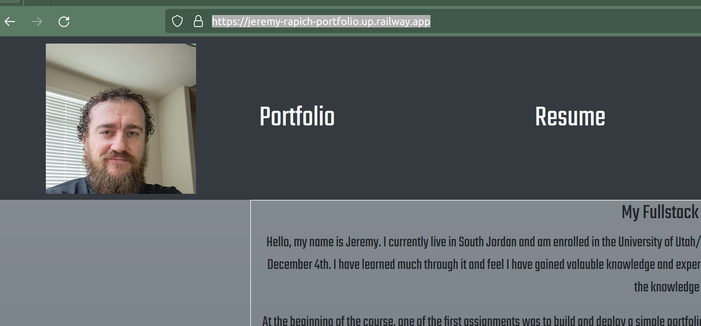

# Jeremy's React Portfolio

            

## Description
This app is a professional portfolio built using React and Vite. It contains my up to date resume as well as links to deployed apps(if applicable) I have worked on throughout the fullstack webdev bootcamp. It is mostly done but has definitely room to improve on the visual and functional side, and will most certainly be expanded in the future as a learn more skills and build more projects.

## Installation
The React app itself exists in the `portfolio/` folder. 

To install it for dev purposes:     

Clone the repo anywhere, then run `npm install` 

for necessary packages, and build the app with `npm run build` 

or, run with vite in dev environment with 

`npm run dev`     

`npm run start` is intended for production environment and will likely fail unless you supply it a port.

## Usage
Usage is simple. Navigate to the various links in the header to  view different parts of the portfolio, including  a Resume, AboutMe, and Contact section.

Link to project repository: 

[https://github.com/jrapich/react-portfolio](https://github.com/jrapich/react-portfolio)

Link to the deployed app:

[https://jeremy-rapich-portfolio.up.railway.app/](https://jeremy-rapich-portfolio.up.railway.app/)

Screenshot:

## Tests
no tests needed

## Credits
No other contributors.

This helped me figure out why an img link was not working in React:

[https://stackoverflow.com/questions/66442875/broken-icon-displayed-instead-of-image-with-alt-text-react](https://stackoverflow.com/questions/66442875/broken-icon-displayed-instead-of-image-with-alt-text-react)

This helped me deploy the project to Railway:

[https://help.railway.app/project-help/f9v3gkPQRy4UShk5SnoPDH/getting-your-create-react-app-running-on-railway/qHRsgxa5n57xLp1yVgk9fP](https://help.railway.app/project-help/f9v3gkPQRy4UShk5SnoPDH/getting-your-create-react-app-running-on-railway/qHRsgxa5n57xLp1yVgk9fP)

## Contributing
How to contribute:

Please reach out to me at jeremysr@proton.me or make a pull request at 

[https://github.com/jrapich/react-portfolio](https://github.com/jrapich/react-portfolio)

## Questions?
Any further questions, comments, or bug reports, can be sent to me at 

jeremysr@proton.me

https://www.github.com/jrapich

## License
This project protected under MIT License.

All rights reserved. See /LICENSE for more information.
